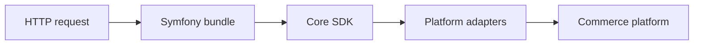
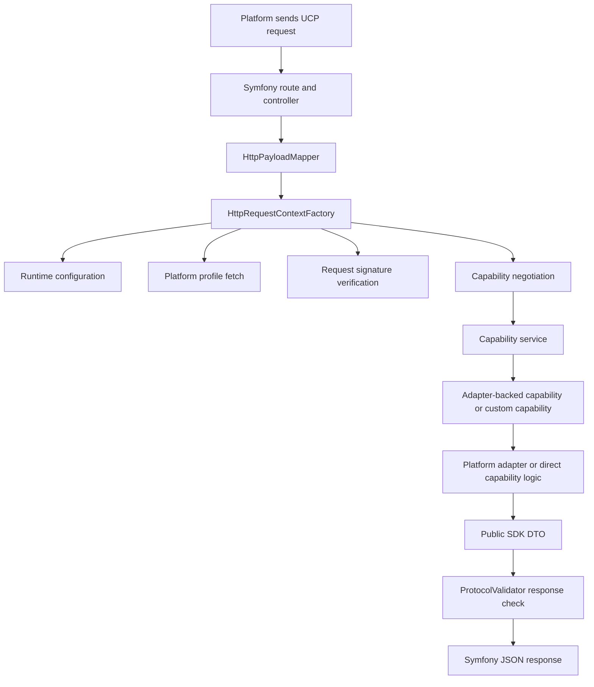
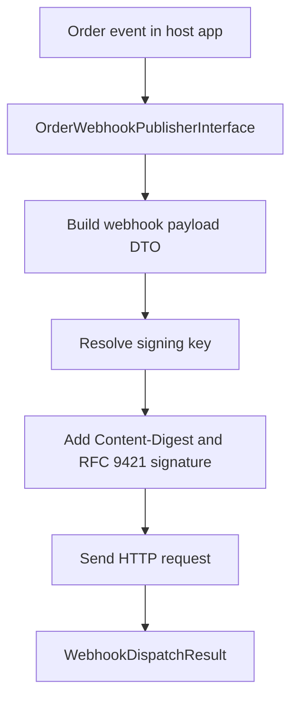
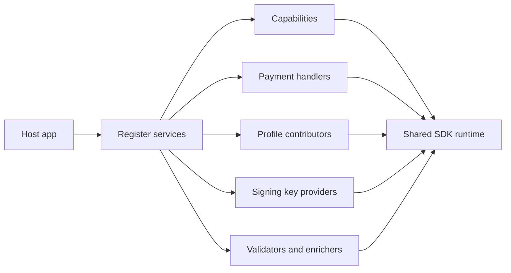
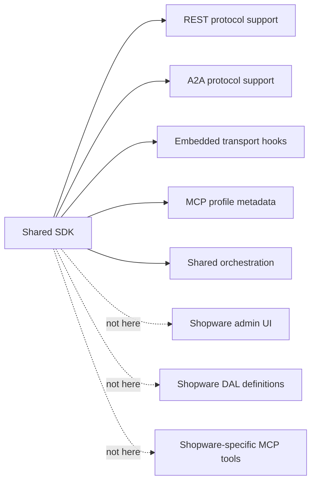

# Concepts And Flows

This document explains the main SDK concepts and the request flow from HTTP to platform code and back.

Use this together with [mapping-flow.md](./mapping-flow.md) and [repo-layout.md](./repo-layout.md).

## Main Layers

- The Symfony bundle owns HTTP wiring and JSON protocol mapping.
- The core SDK owns protocol DTOs, validation, signing, idempotency, negotiation, and shared orchestration.
- Platform adapters translate between the shared SDK and a real commerce platform such as Shopware.

## Inbound Request Flow

Notes:

- `HttpPayloadMapper` is protocol mapping only. It must not become a platform mapper.
- `HttpRequestContextFactory` builds the transport-neutral context used by capabilities and adapters.
- A capability can be fully custom or adapter-backed. The adapter-backed path is a convenience pattern for commerce platforms, not a requirement.

## Outbound Webhook Flow

Notes:

- The shared SDK owns signing and delivery behavior.
- The host app or future platform plugin decides when a webhook should be sent.
- Transport-specific webhook triggers still belong to the host app or future platform plugin.

## Extension Model

- Public extension points live in `Ucp\Sdk\Contract`, `Ucp\Sdk\Repository`, selected `Ucp\Sdk\Service` interfaces, and `Ucp\Sdk\Adapter`.
- Internal classes under `Ucp\Sdk\Internal` and bundle bridge code are not the place to build platform-specific behavior.

## What This SDK Does Not Own

- Keep transport support generic, configurable, and reusable.
- Put platform-specific product, cart, order, and payment mapping into platform plugins.
- For the future Shopware-specific wiring, see [shopware-plugin-blueprint.md](/Users/b.meyer/Documents/Projects/ucp-php-sdk/docs/shopware-plugin-blueprint.md).
