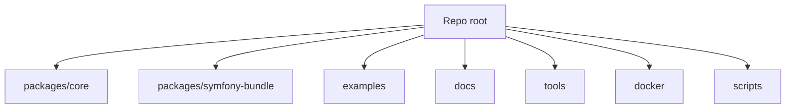
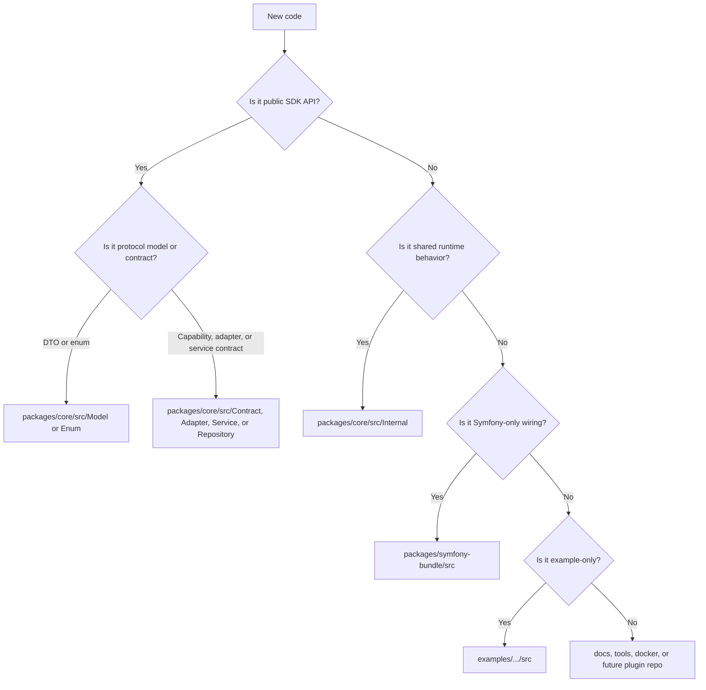
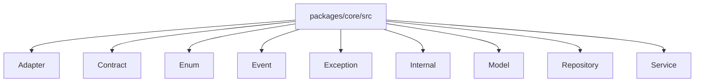
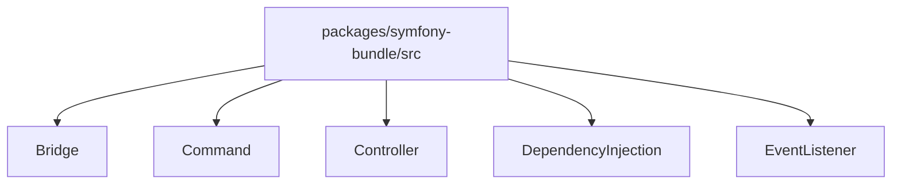
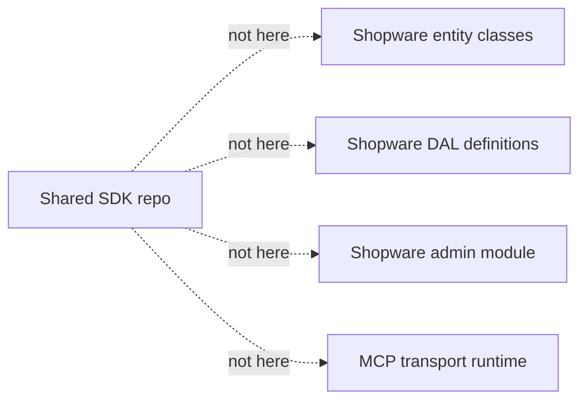

# Repo Layout

This document explains where code and docs belong in this repo.

Use it when you are unsure where to place a new class, config file, test, or note.

## Top-Level Layout

- `packages/core`: framework-free SDK code
- `packages/symfony-bundle`: Symfony HTTP wiring and default storage adapters
- `examples`: sample apps
- `docs`: cross-cutting docs and architecture notes
- `tools`: local helper scripts and QA helpers
- `docker`: repo-local container setup
- `scripts`: helper scripts for repo maintenance

## Placement Rules

| If you are adding... | Put it here | Why |
| --- | --- | --- |
| Public DTOs | `packages/core/src/Model` | Shared protocol model |
| Public capability or adapter contracts | `packages/core/src/Contract` or `packages/core/src/Adapter` | Stable extension surface |
| Public service interfaces | `packages/core/src/Service` | Replaceable integration hooks |
| Public repository interfaces | `packages/core/src/Repository` | Replaceable storage contracts |
| Default runtime implementations | `packages/core/src/Internal` | Internal shared behavior |
| Symfony controllers, listeners, commands | `packages/symfony-bundle/src` | Bundle-owned HTTP and framework wiring |
| Default DBAL storage adapters | `packages/symfony-bundle/src/Bridge/DoctrineDbal` | Default Symfony storage only |
| Example merchant logic | `examples/merchant-symfony-app/src` | Demo code, not shared SDK |
| Tiny integration sample code | `examples/bootstrap-symfony-app/src` | Minimal reference |
| Cross-cutting docs | `docs` | Repo-wide explanation |
| QA and support scripts | `tools` | Local tooling |

## Decision Flow

## Core Package Structure

Use these rules:

- `Adapter`: platform adapter contracts and adapter-backed capabilities
- `Contract`: public business capability and extension contracts
- `Internal`: default implementations and runtime helpers
- `Model`: immutable public DTOs
- `Repository`: public storage contracts
- `Service`: public service interfaces

## Symfony Bundle Structure

Use these rules:

- `Bridge`: framework or storage adapters, not platform-domain mapping
- `Command`: operator commands such as signing-key helpers
- `Controller`: REST endpoints
- `DependencyInjection`: bundle registration and service wiring
- `EventListener`: request or response listeners

## What Must Stay Out Of This Repo Area

- The future Shopware plugin belongs on top of this SDK, not inside `packages/core`.
- MCP stays out of the shared SDK.
- Doctrine DBAL bridge code is a default Symfony storage adapter, not the model every adopter must use.

## Test Placement

| Test type | Put it here |
| --- | --- |
| Core unit test | `packages/core/tests/Unit` |
| Bundle unit or integration test | `packages/symfony-bundle/tests` |
| Example app behavior test | in the main repo PHPUnit suites, using the example app source |

## Docs Placement

| Doc type | Put it here |
| --- | --- |
| Human repo overview | root `README.md` |
| Folder-specific human guide | local `README.md` in that folder |
| Technical agent guidance | local `AGENTS.md` in that folder |
| Cross-cutting architecture note | `docs/*.md` |

## Quick Examples

- New shared checkout DTO: `packages/core/src/Model/Checkout`
- New default RFC 9421 helper: `packages/core/src/Internal/Security`
- New bundle route: `packages/symfony-bundle/src/Controller`
- New default DBAL repository: `packages/symfony-bundle/src/Bridge/DoctrineDbal`
- New Shopware-specific cart mapping: not in this repo area, put it in the future Shopware plugin
