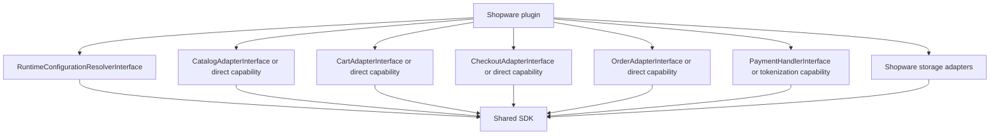

# Shopware Plugin Blueprint

This document describes what a Shopware plugin such as `SwagAgenticCommerce`
should build on top of the shared SDK.

## Shared SDK Responsibilities

Reuse these pieces from the shared SDK:

- public UCP DTOs and contracts
- optional adapter-backed capabilities
- request context, signing, negotiation, idempotency, and validation services
- webhook publisher
- public repository interfaces

## Shopware Plugin Responsibilities

Implement these in the Shopware plugin:

- `RuntimeConfigurationResolverInterface` using sales-channel and domain context
- Shopware-backed platform adapters:
  - catalog
  - cart
  - checkout
  - order
  - identity linking
- payment handlers or tokenization capabilities
- Shopware-backed repository replacements where needed
- plugin-owned tables or DAL state for sales-channel scoped UCP config
- payment method mapping
- order event subscribers that call `OrderWebhookPublisherInterface`
- admin UI, ACL, diagnostics, and operator flows

## Shopware Plugin Shape

## Important Boundaries

- Keep Shopware DAL definitions in the plugin, not in the shared SDK.
- Keep Shopware-specific MCP tools and Store API wiring in the plugin. The shared SDK may advertise MCP endpoints and own generic transport metadata.
- Keep protocol mapping in the bundle. Do not rewrite that logic in the plugin unless Shopware needs platform-specific routing or authentication around it.
- Keep sales-channel configuration in plugin-owned state. Do not push Shopware
  admin UX or DAL assumptions into SDK configuration.

## Suggested Build Order

1. Runtime config resolver
2. Catalog and cart adapters
3. Checkout and payment adapters
4. Order adapter and webhook event triggers
5. Repository replacements where the default storage adapter is not enough
6. Admin UI and diagnostics
